# Golinked.bio — Custom Domain Setup Guide

A step-by-step guide to connect a **custom domain** purchased on **GoDaddy** to your **Golinked.bio** account using Cloudflare nameservers.

---

## Table of Contents
- [Step 1: Purchase a Domain (GoDaddy)](#step-1-purchase-a-domain-godaddy)
- [Step 2: Access DNS Management](#step-2-access-dns-management)
- [Step 3: Open Custom Domain Settings in Golinked](#step-3-open-custom-domain-settings-in-golinked)
- [Step 4: Enter Your Domain](#step-4-enter-your-domain)
- [Step 5: Open GoDaddy Domain Settings](#step-5-open-godaddy-domain-settings)
- [Step 6: Update Nameservers with Cloudflare](#step-6-update-nameservers-with-cloudflare)
- [Step 7: Add Your Custom Domain in Golinked](#step-7-add-your-custom-domain-in-golinked)
- [Step 8: Assign Your Custom Domain to a Link](#step-8-assign-your-custom-domain-to-a-link)
- [Step 9: Choose Custom Domain Options](#step-9-choose-custom-domain-options)

---

### Step 1: Purchase a Domain (GoDaddy)

- Search for your desired domain on GoDaddy.  
- Add it to your cart and complete the checkout process.  
- Once purchased, your domain will appear in your GoDaddy account under **My Products**.  

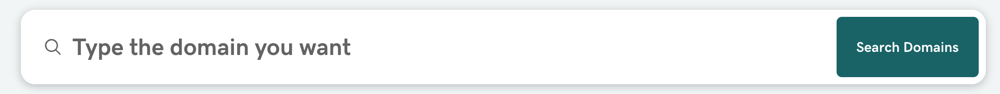

---

### Step 2: Access DNS Management

- In your GoDaddy account, go to **My Products → Domains**.  
- Select your new domain and open **DNS Management**.  
- Keep the domain name copied — you’ll need it in the next steps.  

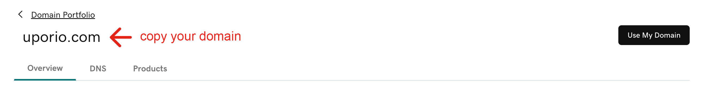

---

### Step 3: Open Custom Domain Settings in Golinked

- Log in to your **Golinked** profile.  
- Go to **Settings → Custom Domains**.  
- Click on **Add Domain**.  

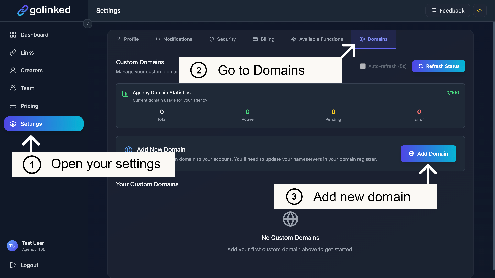  
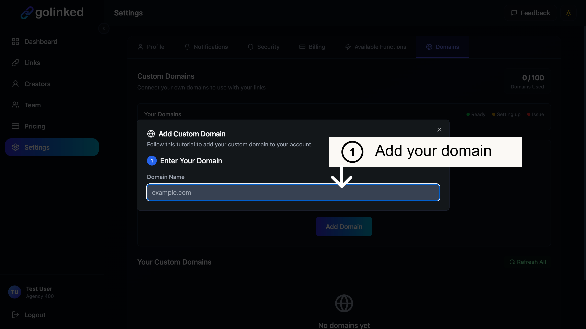

---

### Step 4: Enter Your Domain

- Paste your purchased domain into the input field.  
- Confirm to proceed.  

---

### Step 5: Open GoDaddy Domain Settings

- In Golinked, scroll down to the **GoDaddy section**.  
- Click **Open GoDaddy Domain Settings** to adjust your DNS.  

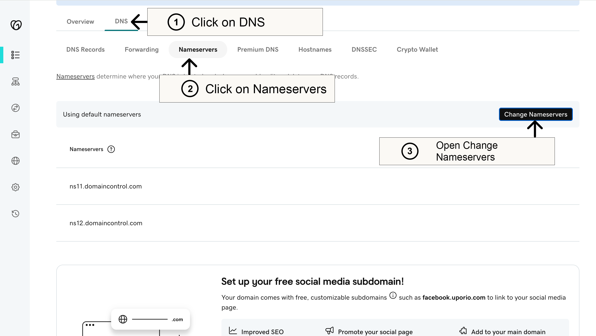

---

### Step 6: Update Nameservers with Cloudflare

- Copy the **Cloudflare nameservers** shown in Golinked.  
- In GoDaddy, go to **DNS → Nameservers → Change Nameservers**.  
- Select **I’ll use my own nameservers**.  
- Paste the Cloudflare nameservers.  
- Save and confirm.  

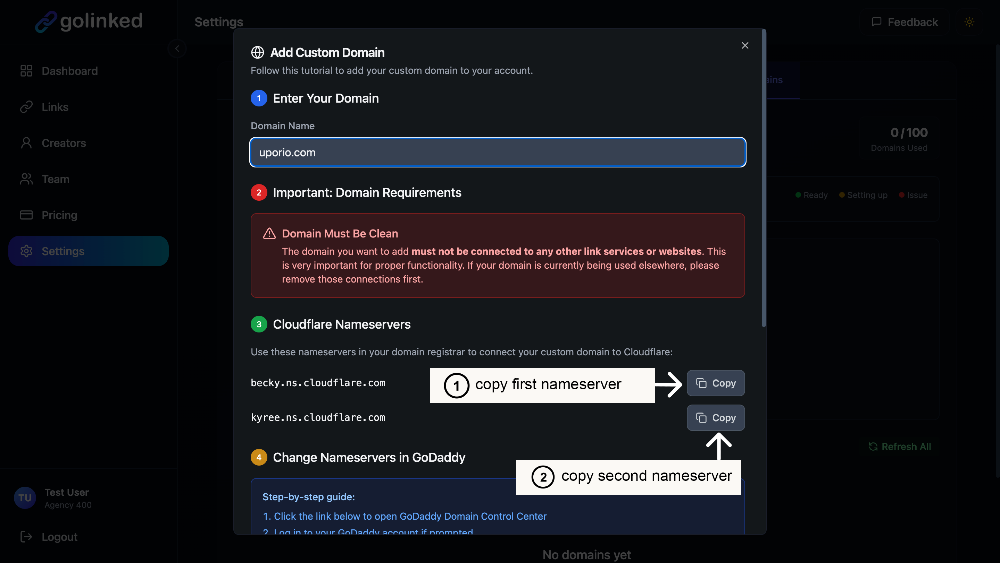  
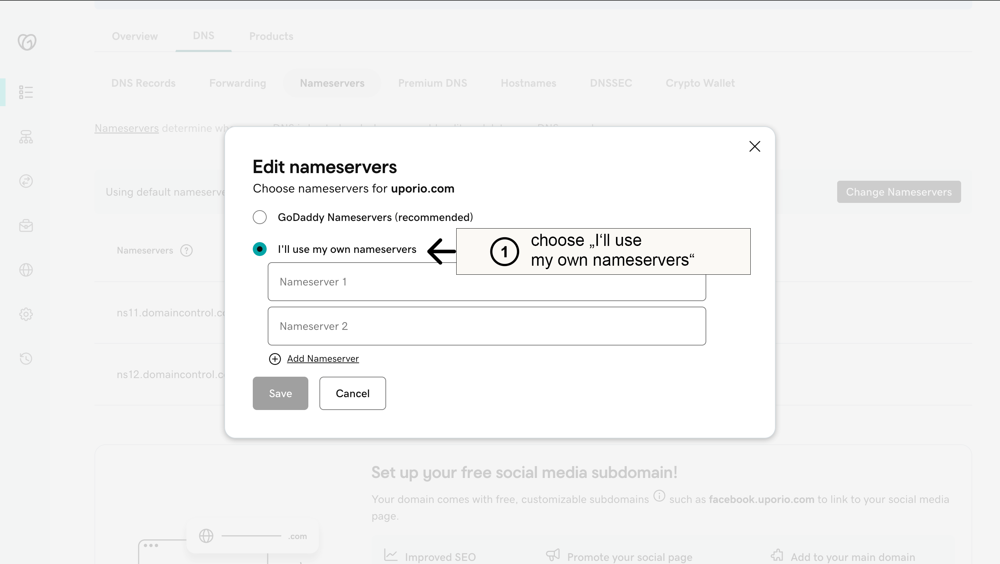  
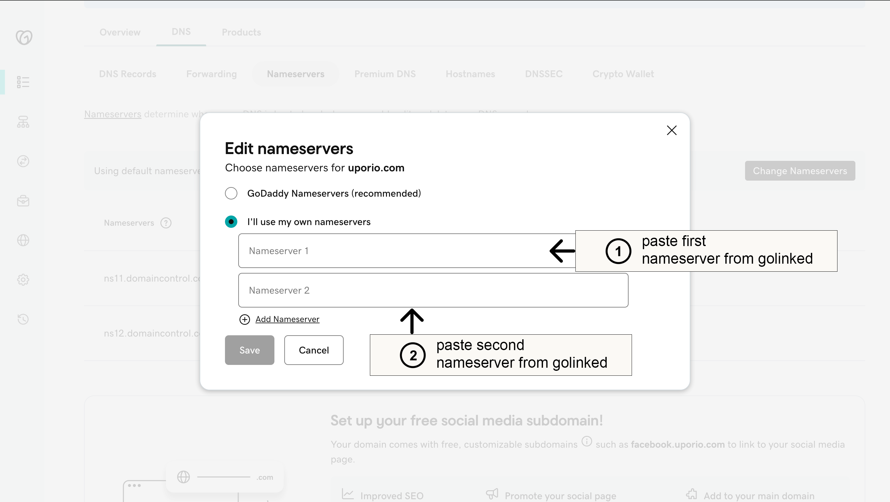

---

### Step 7: Add Your Custom Domain in Golinked

- Go back to Golinked.  
- Click **Add Domain** again to verify and start propagation.  

---

### Step 8: Assign Your Custom Domain to a Link

- Once verified, open your Golinked dashboard.  
- Go to your links and select your new **custom domain**.  

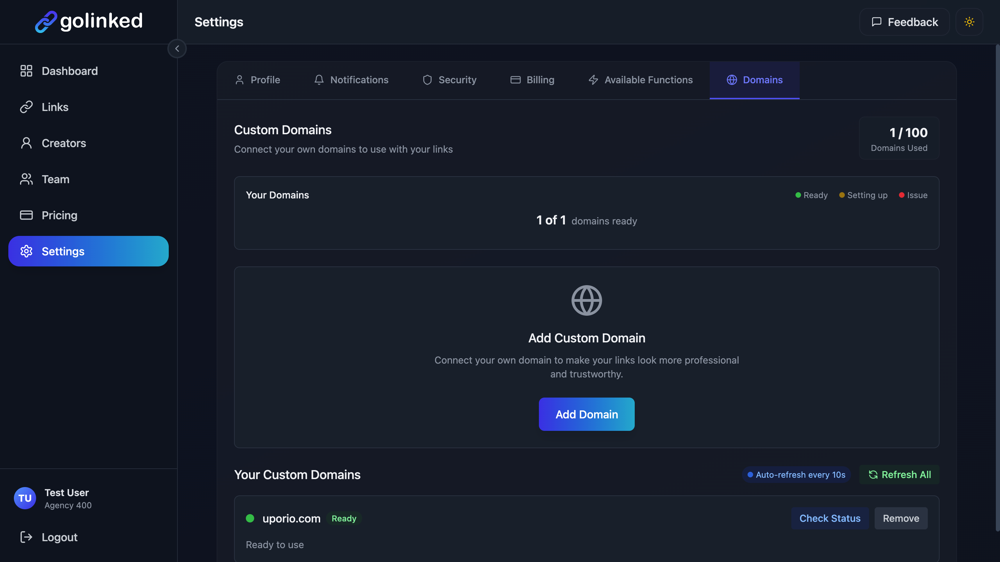  
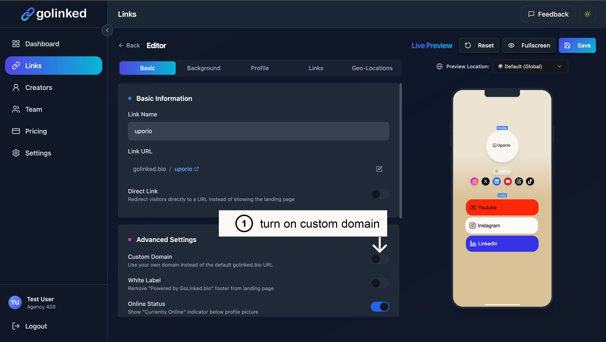

---

### Step 9: Choose Custom Domain Options

- You can choose between:  
  - Root Domain (`example.com`)  
  - Subdomain (`links.example.com`)  
  - Path (`example.com/username`)  

- Save the link to finish.  

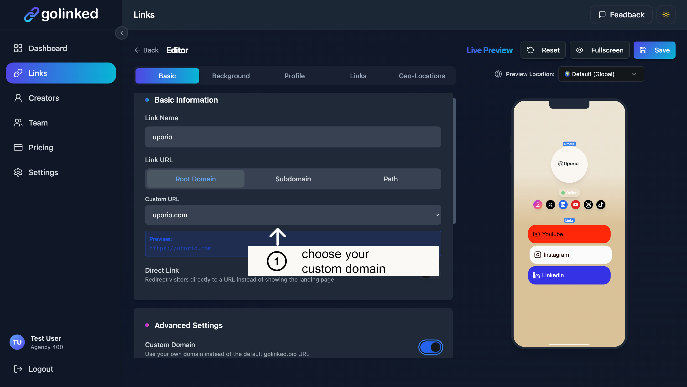

---

## Propagation Time

- Domains usually activate within **10–20 minutes**.  
- In some cases, full DNS propagation can take up to **48 hours**.  

---

## Tips & Common Pitfalls

- **One registrar at a time**: After switching nameservers to Cloudflare, manage DNS only in Cloudflare.  
- **Check spelling**: Nameservers must be copied exactly.  
- **Propagation takes time**: Wait up to 48h before retrying.  
- **HTTPS/SSL**: Configured automatically by Golinked once domain is active.  

---

## Support

If you run into issues, collect screenshots of your **GoDaddy Nameservers page** and **Golinked Custom Domains settings** and contact Golinked support.

